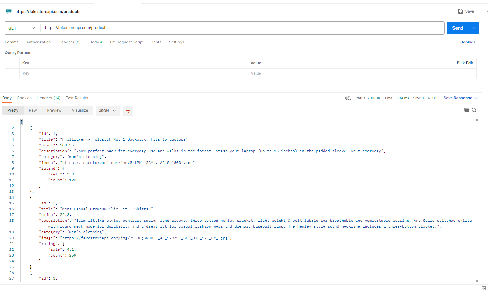
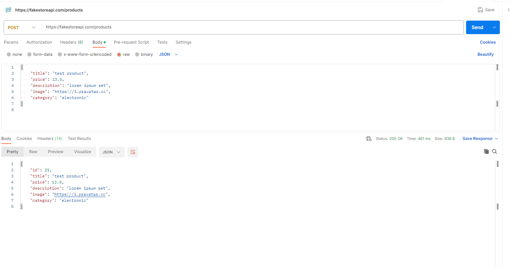
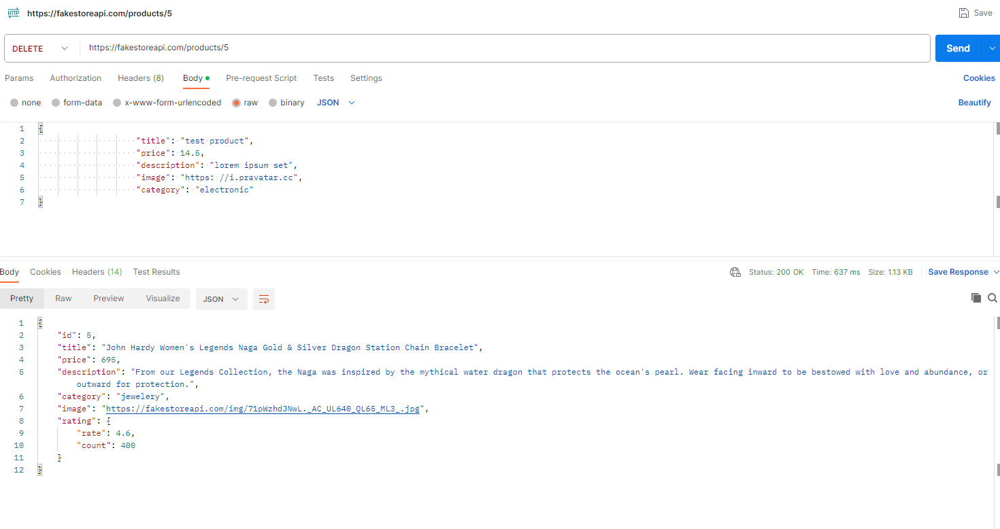
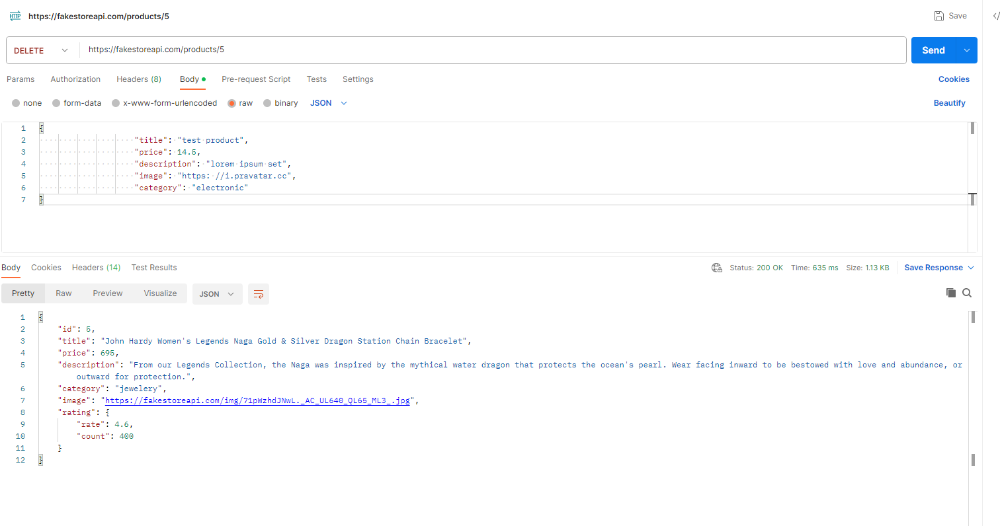
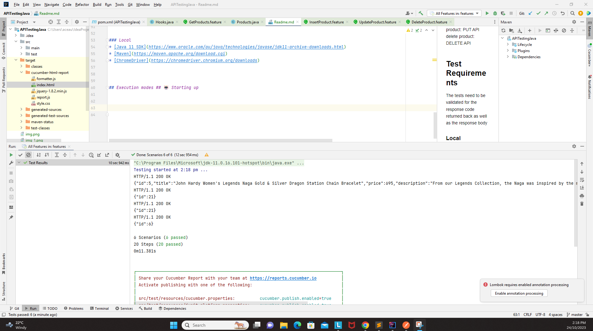
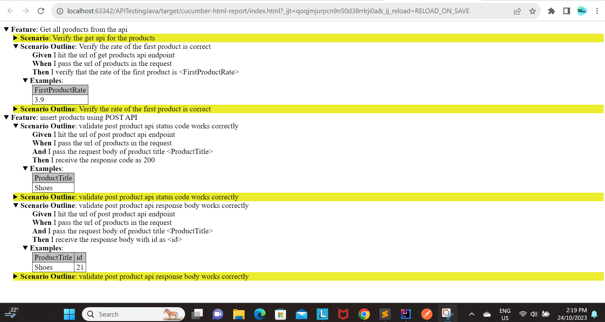

<h1 align="center"> API Testing - Java - using Rest Assured & Cucumber libraries in Bdd framework (GET, POST, PUT, DELETE) apis validation  </h1>  

  Description: This is a demo project on java tech for testing some real time sample apis from https://fakestoreapi.com/ to perform all the verbs (GET, POST, PUT, DELETE) apis validation
 the apis used in this example is 
 GET: https://fakestoreapi.com/products
POST: https://fakestoreapi.com/products
PUT: https://fakestoreapi.com/products/{productnumber}
DELETE: https://fakestoreapi.com/products/{productnumber}

## Table of Contents

- [Introduction](#introduction)
- [Features](#features)
- [Requirements](#requirements)
- [Quick Start](#quick-start)

## Introduction

## Manual Verification:

perform GET API - validate response code and response body
GET

POST API- validate response code and response body
POST:

PUT API- validate response code and response body
PUT:

DELETE API - validate response code and response body
DELETE:

## Features
Get products: GET API
Insert product: POST API
update product: PUT API
delete product: DELETE API

## Test Requirements
The tests need to be validated for the response code returned back as well as the response body

### Local
* [Java 11 SDK](https://www.oracle.com/au/java/technologies/javase/jdk11-archive-downloads.html)
* [Maven](https://maven.apache.org/download.cgi)
* [ChromeDriver](https://chromedriver.chromium.org/downloads)

## Execution modes ## 🤖 Starting up

## Reporting

